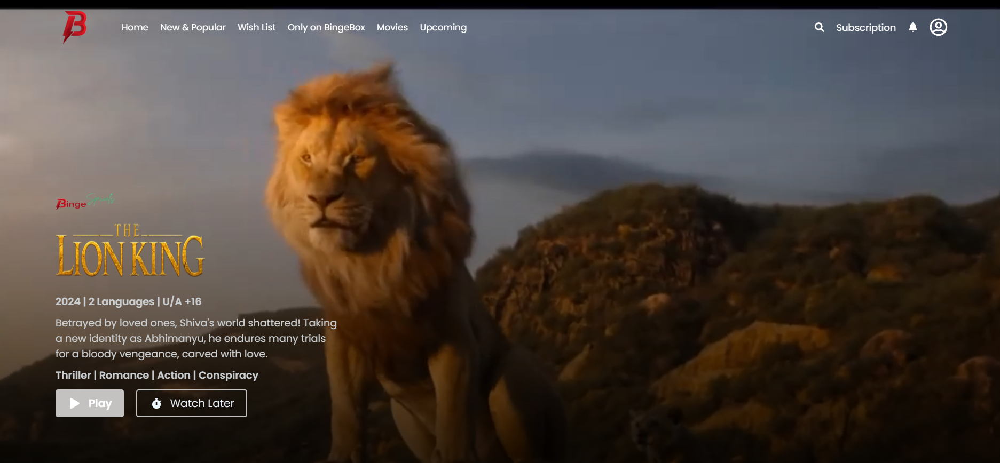
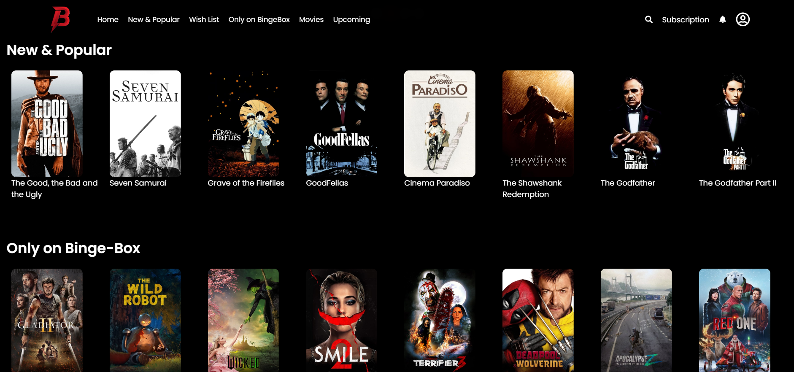
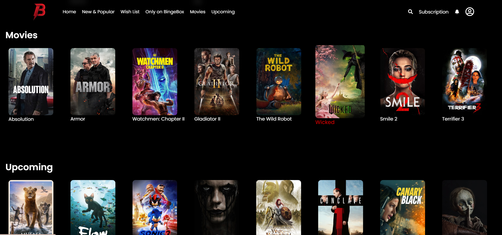
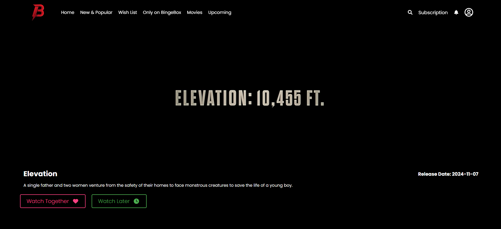
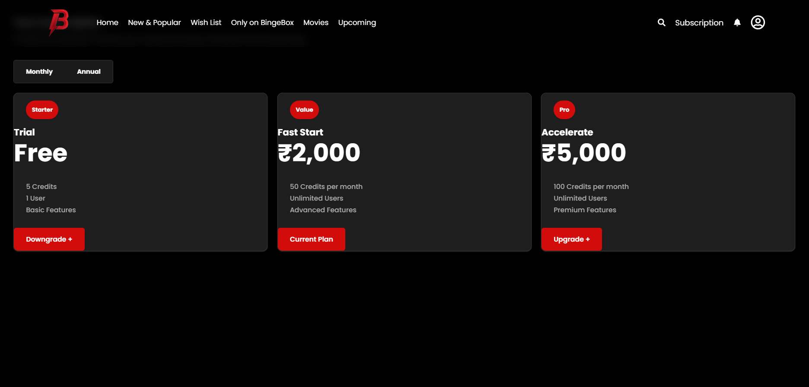
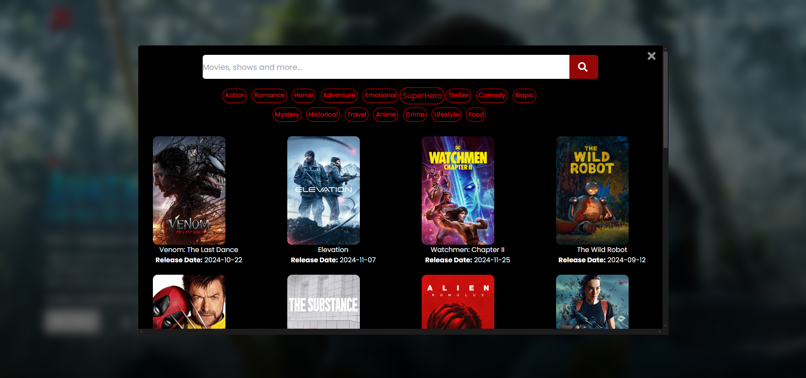

# BingeBox
Watch your favorite movies, anytime, anywhere.

BingeBox is an online movie streaming platform designed to offer a seamless, immersive viewing experience. With a wide range of movies, easy-to-navigate interface, and a subscription-based model, BingeBox is tailored for users seeking entertainment on any device, with an enhanced focus on user experience.

## Overview
BingeBox integrates several advanced features to elevate the movie-watching experience. These include:

- **Loading Page:** A captivating loading screen to enhance the user experience during transitions.
- **Immersive Design:** A modern and visually appealing interface that enhances user engagement.
- **Advanced Search Feature:** Find movies with enhanced filters, making it easier to search by genre, release year, rating, and more.
- **Subscription Page:** Dedicated subscription page to manage user plans and benefits.
- **Wide Range of Movies:** A rich collection of movies from various genres.
- **Online Watch:** Stream movies directly online without any downloads required.

## Features

### 1. Immersive Design
- **Feature:** Modern, visually appealing design focused on delivering an immersive movie experience.
- **Screenshot:** 

### 2. Wide Range of Movies
- **Feature:** A vast collection of movies across different genres, offering something for every taste.
- **Details:** Browse through popular, top-rated, upcoming, and many more movie categories.
- **Screenshot:** 
- **Screenshot:** 

### 3. Online Watch
- **Feature:** Stream movies instantly with a single click.
- **Details:** Enjoy uninterrupted movie streaming in high quality directly in your browser.
- **Screenshot:** 

### 4. Subscription Page
- **Feature:** A dedicated subscription page for users to explore and manage their plans.
- **Details:** Choose between multiple subscription plans and enjoy premium content.
- **Screenshot:** 

### 5. Loading Page
- **Feature:** A visually appealing loading page to entertain users while the content is loading.
- **Details:** Ensures a smooth transition between pages and enhances the user experience.
- **Screenshot:** 

### 6. Advanced Search Feature
- **Feature:** A powerful search tool to help users find movies using various filters.
- **Details:** Users can filter movies by genres, release year, ratings, and other criteria for a more personalized search experience.
- **Screenshot:** 

## Installation
To set up BingeBox locally, follow these steps:

Getting Started
---------------

1.  **Clone the repository:**

    bash

    Copy code

    `git clone https://github.com/your-username/BingeBox.git`

2.  **Navigate to the project directory:**

    bash

    Copy code

    `cd BingeBox`

3.  **Install dependencies:**

    bash

    Copy code

    `npm install`

4.  **Start the development server:**

    bash

    Copy code

    `npm run dev`

5.  **Build the project for production (optional):**

    bash

    Copy code

    `npm run build`

6.  **Preview the production build (optional):**

    bash

    Copy code

    `npm run preview`

* * * * *

Contributing
------------

We welcome contributions to **BingeBox**. To contribute:

1.  **Fork the repository on GitHub.**

2.  **Create a new branch:**

    bash

    Copy code

    `git checkout -b feature/your-feature-name`

3.  **Stage all changes for the next commit:**

    bash

    Copy code

    `git add .`

4.  **Commit the staged changes with a descriptive message:**

    bash

    Copy code

    `git commit -m "Add your feature or fix description"`

5.  **Push the committed changes to a specific branch in your remote repository:**

    bash

    Copy code

    `git push origin feature/your-feature-name`

6.  **Open a pull request:**\
    Go to the original repository on GitHub, compare changes, and open a pull request with a detailed description of your contributions.